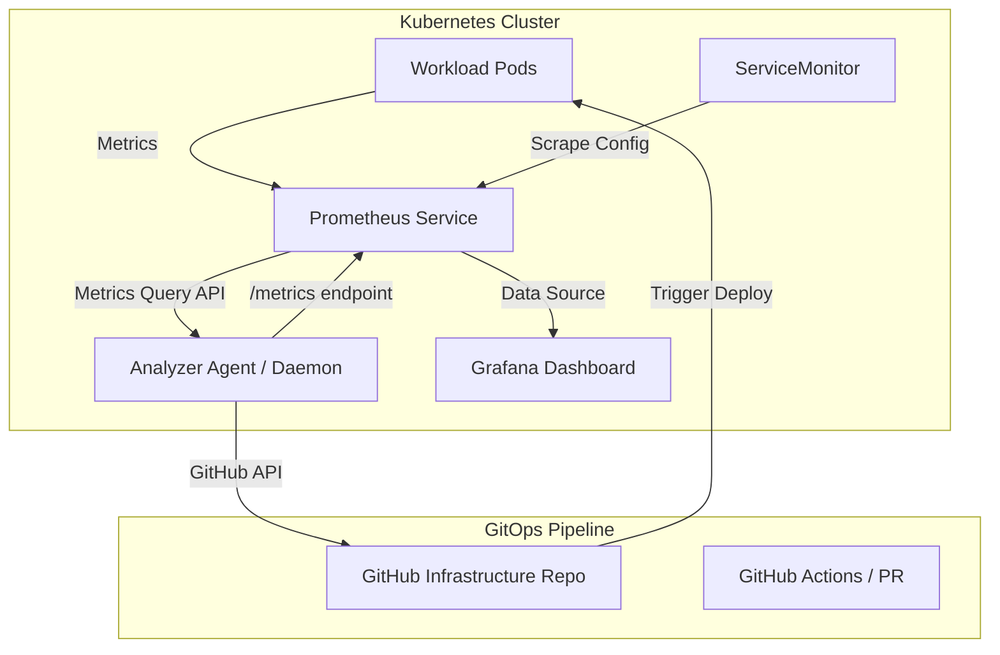

# MVP First Launch Plan

This document outlines the execution checklist, onboarding flow, and launch strategy for the first public release (**v1.0.0-MVP**) of `k8s-prometheus-analyzer`. 

We will prioritize a frictionless onboarding experience and leverage our main technical differentiators (zero-kubectl write access and comment-preserving GitOps resizes) to gain developer trust and community traction.

---

## 🏗️ 1. MVP Target Architecture

The MVP will target a lightweight self-hosted setup that integrates natively into an existing Prometheus/Grafana stack:



---

## 🚀 2. Developer Quick-Start & Onboarding

To maximize adoption, the onboarding documentation must follow the **"2-Minute Rule"** (getting value with minimal commands).

### Step 1: Run Locally (Standalone CLI)
Developers can run a quick scan without deploying anything in the cluster:
```bash
# 1. Install via pip
pip install k8s-prometheus-analyzer

# 2. Port-forward your local Prometheus service
kubectl port-forward svc/kube-stack-kube-prometheus-prometheus 9090:9090

# 3. Run the scan
k8s-analyze --prometheus-url http://localhost:9090
```
* **Result**: A color-coded table is printed to terminal stdout, `optimization_suggestions.json` is exported, and `optimization_report.html` is generated.

### Step 2: Deploy as in-cluster Agent
Once happy, the team deploys the daemon to continuously expose recommendations as Prometheus metrics:
```bash
# 1. Install using Helm
helm repo add k8s-prometheus-analyzer https://charts.yourdomain.com
helm install k8s-analyzer k8s-prometheus-analyzer/k8s-prometheus-analyzer \
  --set prometheus.url="http://kube-stack-kube-prometheus-prometheus.default.svc.cluster.local:9090" \
  --set exporter.serviceMonitor.enabled=true \
  --set grafana.dashboard.enabled=true
```

### Step 3: Visualize in Grafana (Automatic Import)
By deploying the Helm chart with `--set grafana.dashboard.enabled=true`, the chart automatically creates a ConfigMap labeled `grafana_dashboard: "1"`. 

If you are using a standard Prometheus/Grafana stack (like `kube-prometheus-stack`), the Grafana dashboard sidecar will automatically discover this ConfigMap and import the **Kubernetes Resource Optimization Recommendations** dashboard without any manual copy-pasting.

*Alternative (Manual Import):*
1. Copy the contents of the template [dashboard.json](file:///D:/projects/k8s_prometheus_analyzer/grafana/dashboard.json).
2. Go to Grafana ➔ **Dashboards** ➔ **Import**, paste the JSON, and select your Prometheus data source.

---

## 🎯 3. MVP Core Feature Scope

| Feature | Scope | Included in MVP? |
| :--- | :--- | :--- |
| **Prometheus Exporter** | Standard `/metrics` on port 8000. | ✅ Yes |
| **Sizing Rules** | Hardcoded (25% CPU buffer, 20% Memory buffer). | ✅ Yes |
| **Grafana Dashboard** | Standard stat widgets, severity gauges, and workload tables. | ✅ Yes |
| **GitOps Integration** | GitHub Pull Requests with comment preservation. | ✅ Yes |
| **Community Lock** | Soft-limit to $\le$ 15 nodes without a license. | ✅ Yes |
| **GitLab / Bitbucket** | Support for GitLab MRs and Bitbucket PRs. | ❌ No (Post-MVP) |
| **Custom Sizing Rules** | Configurable buffers per workload/namespace in `config.yaml`. | ❌ No (Post-MVP) |
| **Vulnerability Scanning** | Trivy compliance & Cosign image signing. | ❌ No (Post-MVP) |

---

## 📢 4. First Launch Channels & Marketing

The launch will target communities of platform engineers, SREs, and DevOps practitioners:

### Channel 1: Hacker News (Show HN)
* **Angle**: Focus on security, simplicity, and zero-dependency:
  > *Show HN: An open-core K8s right-sizing tool that requires zero kubectl access*
* **Core Hook**: Explain how the tool reads solely from Prometheus and creates Pull Requests while preserving comments, avoiding write-access to the cluster controller.

### Channel 2: Reddit (`r/kubernetes` & `r/devops`)
* **Angle**: Address the "Action Gap" (why engineers ignore static PDF/HTML cost reports):
  > *Automating K8s right-sizing via GitOps PRs without stripping YAML comments*

### Channel 3: GitHub Presentation
* Add a high-quality SVG/GIF of the terminal output directly in the `README.md`.
* Embed a screenshot of the dark-themed Grafana dashboard showing cores/bytes salvageable.

---

## 📋 5. Post-MVP Feature Roadmap

After the initial launch and user feedback collection, we will prioritize:
1. **Multi-platform GitOps**: Supporting GitLab, Bitbucket, and ArgoCD write-backs.
2. **Custom Rules Engine**: Allowing custom PromQL threshold metrics and per-namespace safety buffers.
3. **Enterprise Dashboard**: A native standalone web UI for teams who do not want to use Grafana.
